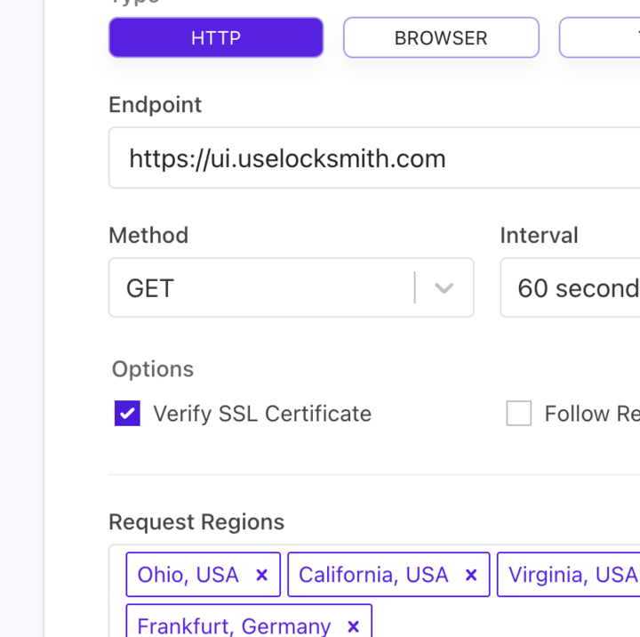

# SSL certificate expiration warnings

We have Cronitor monitors (love that language) keeping an eye on all the spots we accept HTTP traffic. These monitors are configured to verify SSL certificates. This monitoring comes with certificate _expiration_ warnings, which can't be selectively disabled. These warnings are safe to ignore, since Fly manages our certs automatically.

<figure><figcaption>
Here's how that warning looks in Slack
</figcaption></figure>

<figure><figcaption>
Here's how the config looks in Cronitor.
</figcaption></figure>
