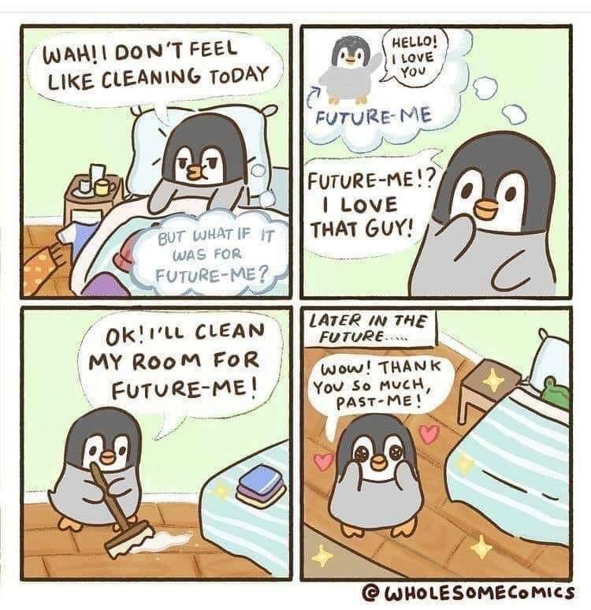

---
layout:
  title:
    visible: true
  description:
    visible: false
  tableOfContents:
    visible: true
  outline:
    visible: true
  pagination:
    visible: true
---

# 3c. Prepare for next time

<figure><figcaption></figcaption></figure>

Be generously kind to whoever loads the game next. That's basically it. It could be you, it could be someone else. Save the game such that it could easily be either.

The more kind to the future you are, the better the odds of your (and our) future good health, which in turn improves things for the good health of all across the timeline.

> Isaac here. :wave: My working memory is limited; I forget things all the time. At this point, I just assume I'll forget everything - and so I treat _the now_ as an opportunity to set the rudder of my boat, so that as the wind takes me I end up where I wanted to go, without having to think about it.
>
> This strategy has worked really well for me, and I suggest it heartily!
>
> \-Isaac

## If you didn't get it all done today...

... make it easier to finish in the future because of what you did today. Make it easy to load the game next time. Remember that it might not be you who picks up gameplay next time.

If you've discovered a broad and/or deep opportunity to [evolve the product](3a-record.md), do what's easy to do now, but do it in a way that will make the _rest_ of the work easier, if and when someone returns to the work.

> I frequently write code in a moment that solves a short-term need while lightly (!!) laying the groundwork for something that I _think_ might be needed later.
>
> At this point, much of the stuff that I'm building now is stuff that I've lightly (!!) prepared to build months or even years ago. It's also true that there's plenty I have yet to return to. Nothing's lost though, because I didn't invest heavily (!!) in those potentials back then. I just thought ahead, and was as kind to my future-self as possible without compromising [my health](../../priorities.md) in the moment.
>
> Think ahead. Don't build it all up front, don't even _commit_ to building it all _at all_. Just think about what you might need to do later, and take deliberate steps in the now such that _the future_ is easier if and when it arrives.
>
> \-Isaac

## If the game is still evolving...

... then set up for notifications (for yourself or for us all), so you can be _on it_ as early as possible when something relevant emerges.


Just as we're responsible for [notifying customers](3b-push.md) when we pass gameplay to them, we can intentionally set ourselves up so that _we_ are notified when gameplay passes to us.


* Make sure email threads have a group address on the cc list. Don't risk having the context be lost in your private email.
* [Follow the Help Scout conversation](https://docs.helpscout.com/article/671-follow-a-conversation), if you want to keep an eye on where it goes. This is a nonintrusive way to make sure that you benefit from the future of a Help Scout thread, even if you don't participate it in the future.
* In Slack, use the "Get notified about new replies" context menu option on any thread you want to keep up with.
* If the thing can be monitored automatically, set up monitoring alerts (New Relic, Rollbar, Cronitor, whatever) for conditions that you know you'll need to pay attention to.

## If you've discovered a thing to be done at a specific time in the future...

... schedule a reminder, to spare your future-self (or whoever's relevant) the pain of having forgotten and having to recover or catch up.

* Send yourself an email, and snooze it until a useful time.
* Use recurring Google Calendar events with email notifications turned on. Invite whoever's relevant. Prefix the event name with "FYI: " if that's useful.
* While many things can be automated, some things are more work to automate than the work they'd save. ([Browserslist updates](https://github.com/browserslist/update-db/blob/a727d276a0a0f0b6a8432221a6014dc524502ad1/README.md#why-you-need-to-call-it-regularly) are one of them.) For those, set up recurring GitHub issues, such that GitHub automatically sets you up with a timely issue to address and close. ([Here's an example for that Browserslist thing](https://gist.github.com/isaacbowen/4ed1cf0ea46375d51255a6a8d5714269).)
